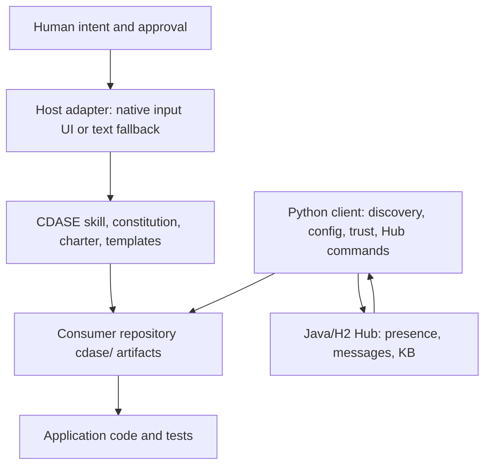
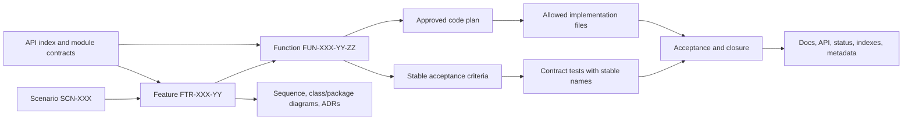

# CDASE Workflow Summary and Comparative Review

- Status: Actioned; reconciled with Blueprint's queue-free template boundary and release controls
- Date: 2026-07-21
- Task: direct user request
- Follow-up: none
- Scope: CDASE's engineering workflow, compared with Blueprint baseline `c2c3e48`, current Blueprint 0.1.2.0 evidence, HeavenBase operational evidence, and DeepSeek Harness
- Decision supported: Which CDASE ideas should improve `heaven-style`, and which should not

## Executive summary

CDASE is best understood as a document-governed change-control protocol for AI-assisted software engineering. Its intended lifecycle is Scenario → Feature → Function → API discovery → staged design and testing → approved code generation → post-delivery reconciliation. Stable identifiers, artifact templates, explicit stage ownership, acceptance-criterion traceability, bounded code plans, and human HARD STOPs make that lifecycle unusually legible.

The current repository, however, contains two systems at very different maturity levels:

1. The engineering lifecycle is mostly normative Markdown and prompt instructions.
2. The boot, configuration, repository-discovery, identity, trust-classification, Hub, and host-input flow has executable Python and Java code.

No executable validator was found for the advertised Scenario/Feature/Function schemas, API reuse/evolve/create decisions, stage transitions, acceptance-criterion-to-test links, code-plan file scope, trace closure, or post-delivery reconciliation. The central lesson is therefore not "write stricter workflow prose." It is: give each important promise an enforcement owner and a fitness function.

Blueprint already has a stronger evidence hierarchy than CDASE: shipped code, tests, generated artifacts, and release configuration outrank plans and reports. At preserved baseline `c2c3e48`, its largest gaps were mechanical: the generated index catalogued metadata without a hermetic graph check, documentation did not distinguish a reusable template from an operational task authority, consumer synchronization was implicit, installation was non-atomic, and the CLI rule was broader than the evidence warranted. The actioned 2026-07-21 slice addresses the first three gaps with a four-surface documentation model, an inert `docs/tasks.template.yaml` starter, role-aware docs validation, `docs/DEVLOG.md`, expiring scratch, deterministic docs/index checks, focused invalid fixtures, one repository check entrypoint, and classified Blueprint-to-HeavenBase synchronization. HeavenBase alone owns the live `docs/tasks.yaml` queue, currently with `HB-001`. The hardened slice also validates skill metadata types and link containment, fingerprints indexed scripts/assets, records exact-path inventory and adapted-consumer fingerprints in a v2 sync manifest, and rejects managed path traversal and symlink targets. The current Blueprint tree collects 41 tests. The canonical skill has been installed globally and matches Blueprint, but the installer itself is still delete-before-copy rather than transactional.

DeepSeek Harness supplies the strongest counterexample to prose-only governance. It makes important claims executable through append-only event logs, exact request reconstruction, transactional publication, quiescent disposal, generated catalogs, property tests, real-loader and built-artifact tests, negative controls, and strict repository gates. Its transferable lesson is not "everything is a plugin" or universal 100% coverage. It is to make authority, ownership, commit points, lifecycle, and evidence observable.

The reconciled Pareto synthesis is:

- Adopt CDASE's traceability, resolved-target discipline, semantic reuse/evolve/create analysis, host-neutral input semantics, proportional change envelopes, and post-delivery reconciliation.
- Use DeepSeek Harness's executable invariants, generated inventories, real-entry tests, transactional lifecycle, and one-home-per-fact documentation discipline to enforce them.
- Retain Blueprint's repository-first compatibility policy, progressive disclosure, open-registry/closed-union distinction, and evidence hierarchy.
- Reject document supremacy, prompt self-elevation, routine mandatory HARD STOPs, universal artifact trees, manual API indexes, source-code blindness, mandatory clean-tree/network synchronization, machine-derived human identity, and blanket version proliferation.
- Treat the docs lifecycle, hardened hermetic index, focused contract fixtures, aggregate offline repository gate, and manifest-v2 source-to-consumer contract as the accepted current slice; do not relabel them as future proposals.
- Retain transactional/offline installation and conditional multi-backend CLI support as unqueued Pareto recommendations; Blueprint template maintenance is driven by the direct user request, not invented local task IDs.

## Scope, baselines, and evidence handling

| Repository | Baseline inspected | Working-tree state | Primary role in this review |
| --- | --- | --- | --- |
| CDASE | `b6166e1` on `main` | Clean before these untracked reports | Reference workflow and executable collaboration runtime |
| Blueprint | preserved baseline `c2c3e48` plus current 0.1.2.0 master | Queue-free template; 41 tests collected; external publication owned by the release workflow | Canonical `heaven-style` 0.1.2.0 source and template owner |
| HeavenBase | prepared 0.1.2.0 source and operational documentation | Live `docs/tasks.yaml` with `HB-001` | Lineage-specific shipped behavior and primary Blueprint consumer |
| DeepSeek Harness | `6b16a67cb` on `master` | Clean | Executable agent architecture and repository fitness functions |

The Blueprint comparison distinguishes the preserved baseline from current master. A changed file is not treated as released merely because it exists locally, and a tagged tree is not treated as published until the hosted release gate agrees.

### Authority and precedence used in this review

1. User instructions and the target repository's policy remain authoritative.
2. Blueprint is the canonical owner of the distributed `heaven-style` skill. Its code, tests, generated artifacts, and accepted repository policy outrank reference-repository lessons.
3. HeavenBase shipped code/tests and current architecture are primary evidence only for HeavenBase-lineage guidance and the declared Blueprint consumer relationship. Accepted-but-planned HeavenBase ADRs remain targets, not current behavior.
4. CDASE and DeepSeek Harness are comparative evidence. Their names, commands, layouts, and runtime-specific mechanics must not leak into source-neutral distributed skill text.
5. The skill stays exactly `0.1.2.0` under the user's explicit no-bump waiver.

Repository-qualified paths are used below:

- `CDASE:<path>` means the inspected CDASE checkout.
- `Blueprint:<path>` means the resolved Blueprint checkout.
- `DSH:<path>` means DeepSeek Harness.

`CDASE:cdase/readme.md` begins by instructing AI to ignore the file. It is treated as conceptual background, not normative workflow evidence. The active workflow evidence is `CDASE:cdase/SKILL.md`, `CDASE:cdase/resources/session-gate.md`, `CDASE:cdase/resources/constitution.md`, `CDASE:cdase/resources/charter.md`, `CDASE:cdase/resources/templates/`, executable scripts, and tests.

## 1. CDASE mental model

CDASE's compact formulation is:

> Repo preserves truth → API coordinates collaboration → Spec is the deliverable.

The three slices in `CDASE:three-slices.md` mean:

| Slice | Claim | Intended benefit | Main risk |
| --- | --- | --- | --- |
| Repository as system | Requirements, design, tests, users, progress, communication, and implementation are versioned together | Auditability and fewer split sources of truth | Git becomes an unsuitable owner for secrets, live presence, or external authority if the boundary is absolute |
| API as collaboration base | Capability discovery and team coordination begin at API contracts | Reuse, anti-duplication, and explicit boundaries | Premature or manually maintained API catalogs can become a second source of truth |
| Spec as deliverable | Structured intent remains stable while code is a validated materialization | Language-independent reasoning and traceability | Treating prose as infallible can hide shipped behavior and validator gaps |

### System layers

The methodology package and consumer runtime are deliberately distinct. The framework repository owns `SKILL.md`, `resources/`, and `scripts/`; an application repository owns its committed `cdase/context/`, requirements, API, design, and run-log artifacts. The Hub is deployed separately.

## 2. Advertised end-to-end workflow

### 2.1 Session activation and bootstrap

The intended boot sequence is:

1. Detect code/project work.
2. Emit a declarative `session.gate` input specification.
3. Require an explicit yes/no opt-in and stop for the answer.
4. Resolve the real application repository and refuse to initialize the CDASE framework repository.
5. Collect a global display profile when absent.
6. Derive a machine-based user ID and reconcile it with the committed repository roster.
7. Seed global Hub settings from a template unless the user requests a custom address.
8. Activate presence and retrieve messages.
9. Use team discovery only when the user asks about the roster or online state.

Relevant sources are `CDASE:cdase/SKILL.md`, `CDASE:cdase/resources/session-gate.md`, and `CDASE:cdase/resources/protocol/repo-resolution.md`.

The multi-repository policy distinguishes:

- the workspace container;
- framework repositories;
- application repositories with a CDASE runtime;
- application repositories without one;
- the one active `CDASE_ROOT` used for engineering work.

This target-resolution step is a genuinely useful control. A workflow should resolve the exact repository and ownership boundary before it writes, especially when the workspace contains sibling checkouts.

### 2.2 Engineering lifecycle

The Charter prescribes this order:

1. Classify whether the request contains engineering intent.
2. Synchronize the repository, require a clean base, and record a run log.
3. Load existing context or perform API-first legacy onboarding.
4. Normalize the user's scenario and obtain approval.
5. Bind applicable templates and rules.
6. Discover required capabilities in the API registry.
7. Resolve each capability as exactly one of reuse, create, or version evolution.
8. Generate missing artifacts and re-check gates until ready or blocked.
9. Execute documentation → HARD STOP → design → HARD STOP → tests, code plan, and code.
10. Verify trace integrity, contract satisfaction, versions, indexes, and required files.
11. Deliver only after gates and explicit approval.
12. Reconcile docs, API registry, tests, stages, and delivery metadata after acceptance.

The controlled sequence lives in `CDASE:cdase/resources/charter.md`, especially its intent, task-compilation, gate-loop, execution, and post-delivery sections.

### 2.3 Artifact graph

| Artifact | What it owns | Notable contract |
| --- | --- | --- |
| Scenario | Actor, natural-language flow, outcomes, constraints, invariants | Human problem before function decomposition |
| Feature | Frozen API/SPI, flow, function composition, stage ownership, feature ACs | Stage table is declared the execution-state owner |
| Function | Signature, stable AC IDs, errors, tests, trace links, risks, version history | Every AC maps to a stable executable test name |
| API registry | Domain capability and module contract inventory | Search before defining a new capability |
| Design | Sequence/class diagrams and ADRs | Design must cover the feature flow |
| Code plan | Allowed files, forbidden areas, small steps, risk points, tests, rollback | Code generation is bounded to approved scope |
| PR declaration | Change intent | Exactly one of `SYNC` or `CODE` |
| Requirements index | Active artifact lookup | Status changes must reconcile the index |
| Run log | Actions, decisions, gates, and outcome | Audit trail for the session |

The strongest individual template ideas are:

- a single stage-ownership table rather than state inferred from prose;
- stable acceptance-criterion identifiers;
- test names derived from function and criterion IDs;
- explicit external dependencies and cycle prohibition;
- risks paired with detection mechanisms;
- a bounded change envelope with rollback;
- a delivery closure step rather than declaring success after code compiles.

### 2.4 Collaboration, configuration, and trust

CDASE distinguishes three concerns:

1. Global machine configuration under `~/.cdase/`.
2. Committed repository roster and optional repository settings under the consumer `cdase/context/`.
3. Hub transport for presence and messages.

Settings resolve in a deterministic precedence chain and record their source. A built-in default Hub address is not treated as explicit activation. This distinction—resolved value, provenance, and explicit/default state—is more useful than a plain merged configuration value.

The host-input design is also strong. `input_specs.py` declares semantic choices/forms, fields, options, fallback text, and apply actions. The host decides whether those semantics appear as buttons, a form, a terminal picker, or plain text. The specification owns what is asked; the adapter owns how it is rendered.

The repository roster is used as a local trust allowlist. Unknown Hub senders are classified separately and cannot be auto-replied to according to the client result. This is useful policy separation, but it is not authentication; the public Hub currently trusts caller-supplied identities.

## 3. What is actually executable

### 3.1 Implemented components

| Component | Implementation | Evidence |
| --- | --- | --- |
| Repository classification | Python workspace/repository discovery and framework detection | `CDASE:cdase/scripts/repo_discovery.py` |
| Configuration | Defaults/global/repo/environment merge with source tracking | `CDASE:cdase/scripts/context_loader.py` |
| Identity | Machine-derived ID, profile overlay, roster validation | `CDASE:cdase/scripts/machine_identity.py`, `context_loader.py` |
| Input semantics | Host-neutral choice/form specifications | `CDASE:cdase/scripts/input_specs.py` |
| Hub client | Health, presence, team, inbox, send, file send, KB | `CDASE:cdase/scripts/cdase_client.py` |
| Trust classification | Trusted/unknown users and messages | `CDASE:cdase/scripts/trust_policy.py` |
| Repository file boundary | Git-root resolution, size checks, selected sensitive-path rejection | `CDASE:cdase/scripts/repo_boundary.py` |
| Hub server | HTTP routing, H2 store, schema, deployment scripts | `CDASE:hub/src/main/java/com/cdase/hub/` |
| Host hooks | Cursor session/sync/team integration | `CDASE:cursor-plugin/`, `.cursor/` |

The Python code has a useful split between a large command router and smaller pure-ish helpers for settings, boot journey, discovery, presence, sync banners, trust, team summaries, and machine identity. The Java Hub has a compact assembly/router/store/database layering.

### 3.2 Advertised but not mechanically enforced

| Workflow claim | Current enforcement | Assessment |
| --- | --- | --- |
| Session opt-in | Prompt/rule instruction; interpretation helper is not the authority | Advisory |
| Framework versus consumer repository | Discovery and warnings; explicit `CDASE_ROOT` can bypass full validation | Partial |
| Explicit Hub URL before Hub commands | Client hard gate | Implemented |
| Roster identity validity | Client validation | Implemented locally |
| Unknown sender cannot auto-reply | Classification result that the agent must honor | Partial |
| Repository-only autonomous file sending | Path/root/size checks | Mostly implemented |
| Multi-repo all-or-none bootstrap | Classification output and instructions; no bootstrap executor | Advisory |
| `AgentAutonomy` and auto-reply config | Parsed and displayed; not enforced by send code | Advisory |
| Scenario/Feature/Function schema | Markdown templates | Not implemented |
| API reuse/evolve/create decision | Prompt rule | Not implemented |
| Stage-gate state machine | Checklists and HARD STOP prose | Not implemented |
| Acceptance criterion ↔ test mapping | Template convention | Not implemented |
| Code-plan file whitelist | Template only; no diff validator | Not implemented |
| Trace/index consistency | Prompt instruction | Not implemented |
| `SYNC` versus `CODE` intent | PR template | Not implemented |
| Post-delivery reconciliation | Prompt instruction | Not implemented |

This distinction should become a general design requirement: rules must declare whether they are enforced by code, a test/scan, an agent review, or a human decision. A bare `MUST` is not a fitness function.

## 4. CDASE's strongest design ideas

### 4.1 Explicit authority and provenance

CDASE repeatedly asks who owns identity, stage state, capabilities, and decisions. The implementation does not always uphold those claims, but the question itself is valuable. Systems should name an authority, distinguish it from transport/cache/index views, and define reconciliation when views disagree.

### 4.2 Semantic capability discovery

Reuse, create, and evolve is a better decision vocabulary than "add another function." Before adding a public capability or open extension, search by semantics, identify the existing owner, and record why the result is reuse, compatible evolution, or a genuinely new contract.

### 4.3 Traceable acceptance

Stable acceptance criteria mapped to executable evidence give a reviewer a direct answer to "what proves done?" The hierarchy encoded in CDASE IDs is too rigid, but local stable criterion IDs and explicit relationships are useful for plans that span modules or sessions.

### 4.4 Proportional change envelopes

Allowed surfaces, forbidden ownership boundaries, frozen contracts, risk points, tests, and rollback make broad or high-risk work safer. This should be a risk-tiered brief, not mandatory paperwork for a one-file reversible fix.

### 4.5 Post-delivery closure

Implementation, tests, public API, docs, generated artifacts, compatibility state, and tracker/review state should agree before a task is called complete. This is a sharper formulation of `heaven-style`'s existing sync criterion.

### 4.6 Host-neutral interaction contracts

Interaction semantics can be stable while rendering remains host-specific. This is the same adapter principle that DeepSeek Harness implements with a typed prompt port and Blueprint intends for service interfaces.

### 4.7 Explicit target resolution

Framework source, installed copies, application repositories, and user-global state must not be confused. The target root should be validated before writes, especially in multi-root workspaces.

## 5. Design liabilities and internal drift

### 5.1 Document supremacy contradicts empirical maintenance

The Constitution says structured documentation outranks code and forbids source-based inference. Current docs and code nevertheless disagree. A safer rule is:

- policy/specification describes intended behavior;
- code, tests, generated artifacts, and release configuration describe shipped behavior;
- a mismatch blocks a confident completion claim and requires reconciliation;
- neither side silently wins without identifying the appropriate owner.

### 5.2 Repository files cannot self-elevate authority

The README tells AI to ignore itself, the Constitution declares itself highest priority and supreme over prompts, and the Charter says user instructions are intent rather than commands. Repository content cannot grant itself system authority or diminish user authority. Such text is a prompt-injection and permission-confusion smell.

### 5.3 Duplicated normative prose drifts

Examples found in the live tree include:

- `SKILL.md` requires Hub sync before every answer, while the Charter calls Hub use lazy.
- `session-gate.md` says `check` refreshes presence, while the current command only checks health.
- trust retrieval is described as server-side allowlist filtering, while the client intentionally fetches all and classifies locally.
- reference identity docs still mention random or environment UUID behavior that the machine-derived implementation replaced.
- the Hub is called transport-only while it also persists and queries knowledge-base entries.
- stage tables, requirements indexes, and metadata use competing status/ownership vocabularies.

One fact needs one normative home. Other surfaces should link to it, and mechanically derivable inventories should be generated.

### 5.4 Governance cost is not proportional to risk

Universal Scenario → Feature → Function artifacts, mandatory clean/sync steps, repeated HARD STOPs, and file whitelists make the clean path expensive even for local reversible changes. This increases viscosity: engineers and agents are incentivized to bypass the process rather than use it.

### 5.5 API-first can become abstraction-first

Searching before adding is good. Freezing an API before enough behavioral evidence exists is not. A stable seam needs current consumers, clear ownership, or demonstrated variation pressure. Closed workflows and state machines should remain exhaustive rather than becoming registries.

### 5.6 Versioning policy creates permanent parallel surfaces

The rule that every acceptance-criterion or invariant change creates a new immutable Function version conflicts with repository compatibility policies and a single canonical API. Internal or pre-release changes should usually break and fix owned callers. Published migrations need named consumers, tests, owners, and removal conditions.

### 5.7 The trust model is classification, not authentication

The public Hub has no authentication or authorization layer. Callers supply actor and sender identifiers; wildcard CORS and message/KB endpoints make local roster filtering insufficient for confidentiality or identity integrity. The useful lesson is to separate provenance, trust, authorization, and transport—not to copy the current identity mechanism.

### 5.8 The toolchain is undeclared and incomplete

The repository has no Python runtime declaration, lockfile, Maven wrapper, or unified environment metadata. The checked runner conditionally reuses a built JAR, omits some tests, and the deploy workflow skips Java tests. Process-control claims are weakened when the process's own verification entrypoint is not reproducible.

## 6. Verification observed during this review

| Command/probe | Result | Interpretation |
| --- | --- | --- |
| `rtk bash cdase/scripts/run_hub_tests.sh` | Stopped because `mvn` is unavailable | No Maven wrapper or declared bootstrap path |
| Python unittest discovery under the available Python 3.9 | 48 attempted: 38 passed, 8 skipped, 2 failed | Useful runtime coverage exists, but the suite is not green or hermetic in the advertised `python3` environment |
| Boot-journey test | Failed due to ambient global profile state | Global state is read instead of injected into the tested decision |
| Client test | Failed before JSON output on `str | None` syntax | Code has an undeclared Python >=3.10 requirement |
| Search for lifecycle vocabulary in executable scripts | No stage/schema/trace implementation found | Core engineering governance remains prose-only |

The tests primarily cover boot, settings, identity, trust, presence, Hub behavior, and repository boundaries. No golden consumer fixture exercises a complete Scenario → Feature → Function → acceptance lifecycle.

## 7. Comparison with Blueprint `heaven-style` and HeavenBase

Blueprint's skill is a portable rule-and-task system, not a workflow engine. Its current strengths include:

- repository `AGENTS.md` and compatibility policy precedence;
- a fast `SKILL.md` front door plus detailed tasks, rules, workflows, examples, and failures;
- Python/TypeScript selection instead of applying both mechanically;
- minimal mental model and one obvious public path;
- open registries for genuinely open families and exhaustive variants for closed sets;
- extension parity, dependency direction, and thin service interfaces;
- targeted-to-broad verification based on risk;
- architecture reviews, change slices, non-goals, rollback posture, and durable handoff docs;
- an authority order in which shipped code/tests/generated artifacts outrank goals, plans, reports, the development log, and scratch;
- four declared documentation surfaces: user docs, engineering truth, one rolling development log, and expiring scratch;
- an explicit queue-free template boundary: `docs/tasks.template.yaml` is inert, the newest template DEVLOG entry uses `Next: none`, and project instantiation promotes the starter to an operational `docs/tasks.yaml`;
- a hermetic `heaven-style-index/v2` projection that validates frontmatter, required field types, duplicate IDs, `related_rules`, link existence/containment, freshness, and a deterministic digest covering Markdown plus indexed scripts/assets;
- focused valid/invalid fixtures for the docs contract, skill index, and Blueprint-to-consumer sync;
- one repository gate, `scripts/check.bash`, wired into hooks and CI;
- explicit template ownership through exact/adapted/excluded classification, managed-path containment and symlink rejection, source/consumer identity, a source commit/content digest, an exact-path inventory, and a fingerprint of reviewed adapted consumer counterparts in `heaven.template-sync/v2`.

The compact index is now 285 lines and 13,428 bytes, down from 1,197 lines, with no volatile timestamp. Its check path imports no HeavenBase runtime and writes nothing. The current docs validator distinguishes template and operational roles, checks inert/live queue boundaries, active-plan authority, development-log ordering, scratch expiry, retired progress paths, task links, and repository-local Markdown links. Blueprint's newest log entry must use `Next: none`; an instantiated operational repository instead resolves `Next` against its live queue. Historical entries may retain closed task IDs as durable handoff evidence.

The actioned slice passed its offline repository gates. The current Blueprint tree now collects 41 tests, including template-role, real-tree rename, template-sync, index, and release-workflow contracts. Blueprint's docs contract reports a template source with no live queue; HeavenBase's corresponding contract reports one live task, `HB-001`. Release status is independently owned by the hosted workflow and is not converted into task state in this survey.

The remaining high-value recommendations are intentionally not a Blueprint queue:

1. Make installation and mirroring staged, rollback-safe, exact, and offline by default; current `install.py` still deletes a verified target before replacement validation and current `sync.py` refreshes a disposable reference checkout through Git. A successful global installation proves deployment, not transactionality.
2. Allow one repository-selected Python CLI framework by default and require multi-backend parity only when the repository declares it; the universal Typer/Click/argparse statement still has more than one home.

Further task-routing metadata and trigger compression may be useful later, but they are not active commitments and must not become a second queue in this report.

### 7.1 HeavenBase lineage evidence

HeavenBase reinforces several of the portable lessons with shipped code and focused tests:

- `docs/resources/architecture/mental-model.md` names what each piece owns, what it must not own, dependency direction, and concrete extension paths.
- `docs/resources/architecture/adr/0010-text-semantics-parity.md` separates compiler availability from concrete semantic proof and fails closed when observation cannot prove a native route.
- `docs/resources/architecture/text-semantics-boundaries.md` freezes result-changing policy into the request so serialization, cache identity, planning, `explain()`, and execution cannot diverge.
- `src/heavenbase/workspace/_bootstrap.py`, `_lifecycle.py`, and focused failure tests prepare a complete workspace before publication and use identity checks so stale rollback or release cannot dislodge a newer owner.
- subprocess import tests prove optional/heavy implementation modules stay lazy rather than trusting an import-design claim in prose.

The important status caveat is equally valuable: ADR 0011 labels standalone Registry and full built-in/external resolution parity as accepted architecture with implementation planned. It explicitly separates shipped 0.1.2.0 behavior from the planned package, installer, seed, and Registry-first migration. `heaven-style` must preserve that current/target/gap distinction rather than presenting an accepted design as runtime fact.

The current Python-matrix conflict is a concrete example of consumer evidence outranking blind template copying. Blueprint must declare and test Python 3.12–3.13 because its locked published HeavenBase 0.1.1.1 dependency contains Python 3.12-only syntax. HeavenBase's current 0.1.2.0 source independently keeps and passes Python 3.10–3.13. These are not contradictory policies: Blueprint's published dependency constrains the template package today, while HeavenBase's source owns its broader compatibility claim. Template synchronization must preserve that adapted consumer boundary.

## 8. Comparison with DeepSeek Harness

DeepSeek Harness is a concrete TypeScript agent runtime and therefore supplies implementation evidence that neither methodology can claim by prose alone.

| Area | DeepSeek Harness pattern | Transferable lesson |
| --- | --- | --- |
| Runtime truth | Append-only session event log; model-visible state reconstructable from it | An authoritative log/projection contract is useful when replay is a real requirement |
| Publication | Prepare privately, install rollback, publish after setup succeeds | Make commit points and rollback explicit |
| Lifecycle | Exact disposers, scoped ownership, quiescent teardown | Ownership includes cleanup completion, not just a cancel request |
| Policy | Monotonic guards and fail-closed unknowns | A later adapter must not undo security policy |
| Extension | Typed services/events and interface/implementation/consumer seams | Create seams for current variation, not imagined plugins |
| Evidence | Runtime invariants, property tests, real Loader, built-artifact and snapshot tests | Test the actual entry path and prove gates fail on invalid input |
| Docs | Generated catalogs, type-equivalent docs, link and freshness checks | Derive inventory from code/types and mechanically detect drift |
| Decisions | Lifecycle-classified Agent Notes with alternatives and consequences | Preserve durable rationale for cross-cutting decisions, not every edit |
| Limitations | Explicitly names what worker isolation, completion reports, and sandboxes do not prove | Claims should include missing guarantees and verification limits |

DeepSeek Harness also supplies cautions:

- "Everything is a plugin" is a repository architecture, not a universal style rule.
- Its own postmortem shows that 100% line/branch coverage did not catch real loader/export-topology failures.
- Universal Agent Notes, exhaustive doc gates, and snapshots for every visible change would be too heavy for many repositories.
- Worker self-report is not independent correctness evidence.
- Worker threads and `vm` are not security sandboxes.

## 9. Cross-system comparison matrix

| Dimension | CDASE | Blueprint `heaven-style` | DeepSeek Harness |
| --- | --- | --- | --- |
| Primary purpose | Govern an AI engineering process | Portable coding/architecture guidance | Ship a composable agent runtime |
| Main authority claim | Structured docs over code | Repo policy, then shipped evidence and owned docs | Session log for runtime; code/types/tests for shipped contracts |
| Workflow state | Feature stage table and requirement index | Blueprint has an inert task starter and no live queue; HeavenBase has live `docs/tasks.yaml`/`HB-001`; both use subordinate plans, one development log, and expiring scratch | Typed events, persisted sessions, goal/task services, Agent Note lifecycle |
| Capability model | Manual API index and reuse/create/evolve | Open registry versus closed union | Typed service/event seams and plugin composition |
| Human control | Mandatory HARD STOPs between phases | User/repo policy plus risk-sensitive approval | Operation-boundary approval and fail-closed policy |
| Test philosophy | Acceptance criteria are contracts | Targeted happy/edge/error plus broader repo gates | Invariants, property, coverage, real composition, snapshots, built artifacts |
| Documentation | Strict templates intended as schemas | Four surfaces, one fact per owner, deterministic docs/index checks, compact generated routing projection | One fact per home, generated catalogs, mechanically checked docs |
| Traceability | Stable hierarchical IDs and run log | Plans, tests, docs, generated artifacts, issue state | Event sequence, request reconstruction, catalogs, Agent Notes |
| Enforcement maturity | Engineering lifecycle mostly agent-enforced | Docs/index/template contracts are code- and fixture-enforced through an offline aggregate gate; install and CLI improvements remain recommendations | Many critical contracts enforced in code and CI |
| Main risk | Ceremony and false confidence in prose | Treating a local or tagged slice as fully released before the hosted repair gate agrees | Repository-specific complexity becoming universal dogma |

## 10. Adopt, adapt, and reject

### Accepted in the current Blueprint slice

- Declare separate user, engineering, development-log, and scratch surfaces with one authority order.
- Keep Blueprint queue-free with inert `docs/tasks.template.yaml`; generated operational projects promote it to their sole writable `docs/tasks.yaml`. HeavenBase owns that live queue today with `HB-001`.
- Retire dated progress trees in favor of one bounded rolling development log and expiring scratch.
- Give docs, generated skill metadata, and template projections deterministic read-only checks plus focused invalid fixtures.
- Keep generated skill routing compact, source-derived, type/containment-validated, content-addressed across Markdown/scripts/assets, and free of volatile timestamps.
- Classify Blueprint-to-HeavenBase template files as exact, adapted, or excluded; reject traversal/symlinks; and record manifest-v2 source identity/digest, exact inventory, and reviewed adapted-consumer fingerprint.
- Label architecture claims as current, accepted target, gap, or non-goal.

### Open recommendations, not queued work

- Transactional/offline installation, exact managed mirrors, explicit reference refresh, and failure-injection evidence.
- Conditional multi-backend CLI parity with one normative criterion home.

### Adopt as general design criteria

- Every governance rule names its enforcement owner and verification path.
- Target repository/root is explicitly resolved before mutation.
- Resolved configuration exposes value, provenance, and explicit/default status.
- Interaction intent is declared independently of host rendering.
- Public capability work records reuse, compatible evolution, or new-contract reasoning.
- Broad/high-risk changes use a concise change envelope with invariants, owned surfaces, forbidden boundaries, tests, risks, and rollback.
- Completion reconciles implementation, tests, API/docs/examples, generated artifacts, compatibility state, and issue/review state.
- Generated inventories are freshness-gated; critical validators have an invalid fixture proving they can fail.

### Adapt proportionally

- Use risk-tiered gates, not a fixed stage bureaucracy.
- Use local stable criterion IDs for durable plans, not ownership-encoded global IDs.
- Treat file lists as expected scope plus protected boundaries, allowing necessary tests/docs/generated updates.
- Persist decisions and gate evidence, not every conversational action.
- Read declared policy and intent first, then verify against source, tests, and generated behavior.
- Use a checked API/capability inventory only when the surface is large or independently extensible.
- Require real-entry and lifecycle tests where integration, publication, or disposal risk exists.

### Reject

- Repository text declaring itself a system prompt or supreme authority.
- Reinterpreting user instructions as non-authoritative intent.
- Documentation automatically overriding executable reality.
- Prohibiting source inspection.
- Universal Scenario → Feature → Function artifacts.
- Mandatory clean-tree/base synchronization before read-only reasoning.
- Network sync before every answer.
- Machine identity as human identity or unauthenticated UUID trust.
- All-or-none initialization across unrelated repositories.
- Default delegated external messaging or auto-reply.
- Manual API catalogs that compete with runtime registration.
- Full version creation for every acceptance/invariant change regardless of compatibility policy.
- Copying "everything is a plugin," universal 100% coverage, or mandatory decision notes into a general skill.

## 11. What to remember

CDASE's enduring idea is not its artifact count. It is that an AI engineering workflow should make intent, authority, state, evidence, scope, and completion visible.

DeepSeek Harness adds the essential qualification: visibility is not enforcement. Critical claims need executable invariants, generated views, real-entry evidence, clear commit points, and honest limitations.

Blueprint should therefore improve `heaven-style` by mechanizing and compressing its existing design—not by turning it into a repository workflow engine. The detailed, version-preserving plan is `Blueprint:docs/reports/surveys/2026-07-21-heaven-style-improvement-proposal.md`.

## Evidence inventory

### CDASE

- `CDASE:cdase/SKILL.md`
- `CDASE:cdase/resources/session-gate.md`
- `CDASE:cdase/resources/constitution.md`
- `CDASE:cdase/resources/charter.md`
- `CDASE:cdase/resources/protocol/input.md`
- `CDASE:cdase/resources/protocol/repo-resolution.md`
- `CDASE:cdase/resources/templates/feature.md`
- `CDASE:cdase/resources/templates/function.md`
- `CDASE:cdase/resources/templates/code_plan.md`
- `CDASE:cdase/scripts/`
- `CDASE:hub/src/`
- `CDASE:cdase/scripts/tests/`

### Blueprint

- `Blueprint:AGENTS.md`
- `Blueprint:docs/README.md`
- `Blueprint:docs/tasks.template.yaml`
- `Blueprint:docs/DEVLOG.md`
- `Blueprint:docs/scratch/README.md`
- `Blueprint:.agents/skills/heaven-style/SKILL.md`
- `Blueprint:.agents/skills/heaven-style/references/tasks/skill-update.md`
- `Blueprint:.agents/skills/heaven-style/references/workflows/architect.md`
- `Blueprint:.agents/skills/heaven-style/references/workflows/editor.md`
- `Blueprint:.agents/skills/heaven-style/references/rules/project/{interfaces,test,docs,extension}.md`
- `Blueprint:.agents/skills/heaven-style/scripts/{index,install,sync,scan}.py`
- `Blueprint:scripts/{check,docs,template_sync}.{bash,py}`
- `Blueprint:.blueprint-template.yaml`
- `Blueprint:tests/test_{docs_contract,heaven_style_index,template_sync}.py`
- `Blueprint:tests/test_release_workflow.py`
- `Blueprint:pyproject.toml`
- `Blueprint:.github/workflows/{python-test,release}.yml`
- `Blueprint:.github/workflows/code-quality.yml`

### HeavenBase

- `HeavenBase:docs/tasks.yaml` (`HB-001`)
- `HeavenBase:docs/resources/architecture/mental-model.md`
- `HeavenBase:docs/resources/architecture/adr/0010-text-semantics-parity.md`
- `HeavenBase:docs/resources/architecture/adr/0011-standalone-registry-and-lego-resolution.md`
- `HeavenBase:docs/resources/architecture/text-semantics-boundaries.md`
- `HeavenBase:src/heavenbase/workspace/{_bootstrap,_lifecycle,_metaschema_service}.py`
- `HeavenBase:tests/core/{test_core,test_public_api}.py`
- `HeavenBase:pyproject.toml`
- `HeavenBase:.github/workflows/{python-test,release}.yml`

### DeepSeek Harness

- `DSH:AGENTS.md`
- `DSH:packages/AGENTS.md`
- `DSH:docs/architecture.md`
- `DSH:docs/testing.md`
- `DSH:docs/defensive-patterns.md`
- `DSH:docs/tool-execution-pipeline.md`
- `DSH:.agents/notes/README.md`
- `DSH:packages/core/{session,tools,agent-loop}/`
- `DSH:packages/session-persistence/`
- `DSH:packages/workflow/`
- `DSH:scripts/`
